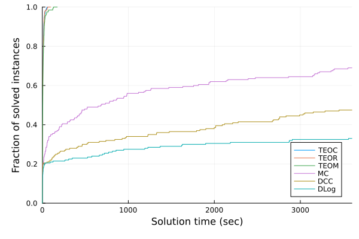

# How to Solve an Instance
The following command solves a multi-commodity problem with tree ensemble cost model instance using six formulation (TEOC, TEOR, TEOM, MC, DCC, DLog) described in Section 5.2 in the paper:
```
julia main_solver_single_instance.jl
```

Users can modify `main()` function to solve different problem instances. 
```
function main()
    ##### Parameters
    M, N = 5, 2
    C, D, T = 2, 5, 1
    random_seed = 1 # 1 to 10
    result_file = "result.csv"
    timelimit_sec = 300

    for formulation in ["TEOM", "TEOR", "TEOC", "DCC", "DLog", "MC"]
        ##### Solve
        output = run(formulation, random_seed, M, N, C, D, T; timelimit=timelimit_sec, verbose=0)

        ##### Write
        instance_info = Dict("M"=>M, "N"=>N, "C"=>C, "D"=>D, "T"=>T, "seed"=>random_seed, "formulation"=>formulation, "timelimit"=>timelimit_sec)
        merge!(output, instance_info)
        CSV.write(result_file, DataFrames.DataFrame(output), append=isfile(result_file))
    end
end
```

* `M`: The number of supply nodes
* `N`: The number of demand nodes
* `C`: The number of commodities
* `D`: The maximum depth of each decision tree
* `T`: The number of decision trees describing the cost function of each edge
* `random_seed`: Seed to generate different cost function
* `time_limit_sec`: time limit for a MIP solve in seconds

# Full Result Data & Data Profile Generation
`result_data/` contains the result of 1200 (`easy.csv`) + 240 (`hard.csv`) MIP solves. 

`main_generate_data_profile.jl`  produces a data profile chart in Figure EC.6 in the paper using the result data.

## CDF of Solve Times Per Formulation -- 200 Easy Instances


## CDF of Solve Times Per Formulation -- 80 Hard Instances

